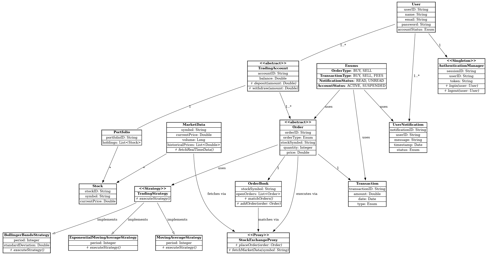

# Online Stock Trading Platform  

This repository contains a full-fledged implementation of an **Online Stock Trading Platform** built using **Spring Boot**. The platform is designed to allow users to trade stocks seamlessly, providing real-time market data, notifications, and multiple trading strategies. The architecture follows SOLID principles, design patterns, and an extensible structure with MySQL as the database.  

## Features  

- **User Management**: Create, update, and manage user accounts.  
- **Order Management**: Place buy/sell orders with validations for account balance and stock availability.  
- **Trading Strategies**: Execute trades based on indicators like Moving Average, Bollinger Bands, and Exponential Moving Average (via the Strategy Design Pattern).  
- **Real-Time Notifications**: Notify users about trade execution, account updates, and other events.  
- **Real-Time Market Data**: Integrate with stock exchange APIs for market updates.  
- **Security**: Includes two-factor authentication, data encryption, and robust user management.  
- **Scalability**: Designed to handle concurrent user requests and large-scale operations.  

## Technologies Used  

- **Spring Boot**: Framework for building Java-based backend applications.  
- **MySQL**: Relational database for storing user, order, and transaction data.  
- **Hibernate/JPA**: ORM for database operations.  
- **Design Patterns**:  
  - **Strategy Pattern**: For implementing trading strategies.  
  - **Singleton Pattern**: For managing shared services like `NotificationManager`.  
  - **Factory Pattern**: For creating strategies dynamically.  
  - **Observer Pattern**: For handling user notifications.  
  - **Proxy Pattern**: For communication with external stock exchange APIs.  

## Class Diagram  

Below is the class diagram representing the structure of the application:  



### Key Components:  

1. **User**: Represents users of the platform with their trading accounts.  
2. **Order**: Handles buy/sell orders with details like price, quantity, and type.  
3. **Trading Strategies**: Encapsulates trading logic for different indicators.  
4. **Notification Management**: Sends real-time notifications to users.  
5. **Market Data and Proxy**: Provides live stock market data using the Proxy Design Pattern.  


## How to Run  

1. **Clone the Repository**:  
   ```bash  
   git clone https://github.com/DHIVAKER29/StockTradingApp.git 
   cd StockTradingApp  
   ```  

2. **Set Up MySQL Database**:  
   - Create a database named `stockTradingApp`.  
   - Update `application.yml` with your MySQL credentials.  

3. **Run the Application**:  
   ```bash  
   ./mvnw spring-boot:run  
   ```  

4. **API Endpoints**:  
   - **User Management**:  
     - `POST /api/users` - Create a user.  
     - `GET /api/users/{userId}` - Get user details.  
   - **Order Management**:  
     - `POST /api/orders` - Place an order.  
   - **Notifications**:  
     - `GET /api/notifications/{userId}` - Get user notifications.  

## Tests  

Run tests using Maven:  
```bash  
./mvnw test  
```  

  
